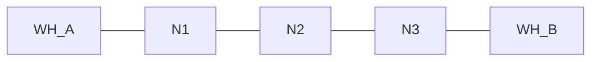
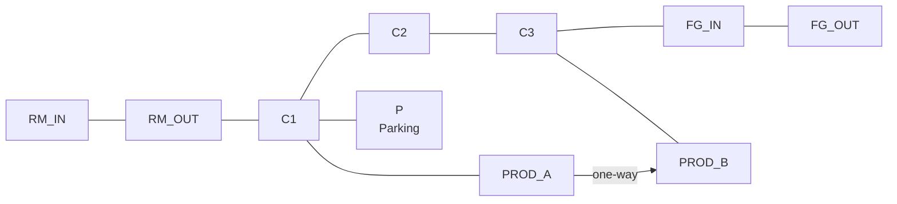
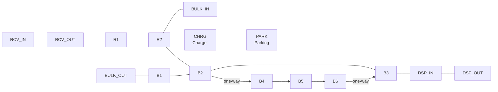

# Intralogistics examples

Three runnable scripts in [`examples/`](https://github.com/dmezzogori/simulatte/tree/main/examples) form a progressive learning path --- from a minimal setup to a full-shift warehouse operation.

| Example | Layout | AGVs | SKUs | Key features |
|---------|--------|------|------|--------------|
| [Simple](#simple) | 5 nodes (preset) | 2 | 1 | `build_simple_system`, text output |
| [Intermediate](#intermediate) | 10 nodes (manual) | 3 | 3 | Custom graph, dispatch strategy, parking, staggered orders, plots |
| [Advanced](#advanced) | 16 nodes (manual) | 5 | 5 | 3 warehouses, battery lifecycle, charging, replenishment, EMA metrics, 4 plots |

---

## Simple

**File:** [`examples/intralogistics_simple.py`](https://github.com/dmezzogori/simulatte/blob/main/examples/intralogistics_simple.py)

The minimal starting point. Uses `build_simple_system()` to create a 5-node linear graph with two warehouses and two AGVs. Submits four transfer orders and prints results.



**What it demonstrates:**

- Using `build_simple_system()` for quick setup
- Creating orders with `coordinator.create_order()` and `coordinator.submit()`
- Reading results: order status, inventory levels, fleet utilization

**Run it:**

```bash
uv run python examples/intralogistics_simple.py
```

### Run it in the browser

```python { .run }
from __future__ import annotations

from simulatte.environment import Environment
from simulatte.intralogistics import OrderStatus, SKU, build_simple_system


def fmt_time(value: float | None) -> str:
    return "-" if value is None else f"{value:6.1f}"


def main() -> None:
    with Environment() as env:
        coordinator, agvs, warehouse_a, warehouse_b, graph = build_simple_system(env)

        sku = SKU("A", weight=1.0, volume=0.1)
        quantities = [5, 8, 12, 6]

        initial_a = warehouse_a.get_inventory_level(sku)
        initial_b = warehouse_b.get_inventory_level(sku)

        orders = []
        for quantity in quantities:
            order = coordinator.create_order(
                sku=sku,
                quantity=quantity,
                origin=warehouse_a,
                destination=warehouse_b,
            )
            coordinator.submit(order)
            orders.append(order)

        env.run(until=120.0)

        completed = sum(order.status is OrderStatus.COMPLETED for order in orders)

        print("Simple intralogistics example")
        print(f"Layout nodes: {len(graph.nodes)}")
        print(f"AGVs: {len(agvs)}")
        print(f"Simulation time: {env.now:.1f}")
        print(f"Completed orders: {completed}/{len(orders)}")
        print()
        print(f"WH-A inventory: {initial_a:.0f} -> {warehouse_a.get_inventory_level(sku):.0f}")
        print(f"WH-B inventory: {initial_b:.0f} -> {warehouse_b.get_inventory_level(sku):.0f}")
        print()
        print("order qty status     dispatch   pick deliver agv")
        for idx, order in enumerate(orders, start=1):
            agv_id = order.assigned_agv.agv_id if order.assigned_agv is not None else "-"
            print(
                f"{idx:>5} {order.quantity:>3} {order.status.name:<10}"
                f" {fmt_time(order.dispatched_at)}"
                f" {fmt_time(order.picked_at)}"
                f" {fmt_time(order.delivered_at)} {agv_id}"
            )

        print()
        print(f"Fleet utilization: {coordinator.fleet_utilization:.1%}")
        for agv in coordinator.agv_report():
            print(
                f"{agv['agv_id']}: state={agv['state']}, battery={agv['battery_pct']:.1%}, node={agv['current_node']}"
            )


if __name__ == "__main__":
    main()
```

---

## Intermediate

**File:** [`examples/intralogistics_intermediate.py`](https://github.com/dmezzogori/simulatte/blob/main/examples/intralogistics_intermediate.py)

A manufacturing plant with Raw Materials and Finished Goods warehouses connected by a corridor with production floor branches. Builds everything manually --- no builder functions.



All corridor arcs are bidirectional. `PROD_A → PROD_B` is one-way, providing a forward bypass when the main corridor is busy.

**What it demonstrates:**

- **Custom graph construction** --- manual `Node`, `Arc`, and `LayoutGraph` instead of a builder
- **Multiple SKUs** --- Steel Sheets (80 kg), Plastic Pellets (15 kg), Electronics (2 kg) with weight/volume capacity constraints
- **Dispatch strategy** --- `NearestIdleStrategy` selects the closest idle AGV for each order
- **Parking and repositioning** --- `ParkingArea` at node P with `NearestParkingPolicy` sending idle AGVs back to parking
- **Staggered order batches** --- three batches at t=0, t=30 min, and t=60 min to show queuing dynamics
- **Time-series plots** --- `DefaultIntralogisticsCollector` with `plot_fleet_utilization()` and `plot_pending_orders()`

**Key configuration:**

```python
# 3 AGVs with trapezoidal speed profile
speed_profile = TrapezoidalProfile(max_speed=1.5, acceleration=0.8, deceleration=1.0)
agv_type = AGVType(
    name="standard",
    speed_profile=speed_profile,
    battery_capacity=200.0,
    weight_capacity=100.0,
    volume_capacity=3.0,
    ...
)

# 8 orders across 3 batches, all Raw Materials -> Finished Goods
batches = [
    (0,    [(steel, 1), (plastic, 2), (electronics, 3)]),
    (1800, [(steel, 1), (plastic, 3), (plastic, 2)]),
    (1800, [(electronics, 3), (steel, 1)]),
]
```

**Sample output:**

```
Manufacturing Plant Floor — Intermediate Example
Layout: 10 nodes, 10 arcs
Fleet: 3 AGVs
Simulation time: 7200s (120 min)
Orders: 8 submitted, 8 completed, 0 failed
Avg fulfillment time: 151.2s
```

**Run it:**

```bash
uv run python examples/intralogistics_intermediate.py
```

### Run it in the browser

Click ▶ Run --- the time-series plots render below the text output.

```python { .run }
from __future__ import annotations

from simpy.events import ProcessGenerator

from simulatte.environment import Environment
from simulatte.intralogistics import (
    AGV,
    AGVType,
    Arc,
    DefaultIntralogisticsCollector,
    FleetCoordinator,
    LayoutGraph,
    NearestIdleStrategy,
    NearestParkingPolicy,
    Node,
    OrderStatus,
    ParkingArea,
    SKU,
    TrapezoidalProfile,
    Warehouse,
)


def fmt_time(value: float | None) -> str:
    return "-" if value is None else f"{value:7.1f}"


def order_batches(
    env: Environment,
    coordinator: FleetCoordinator,
    raw_materials: Warehouse,
    finished_goods: Warehouse,
    skus: list[SKU],
    orders: list,
) -> ProcessGenerator:
    steel, plastic, electronics = skus
    batches: list[tuple[float, list[tuple[SKU, int]]]] = [
        (0, [(steel, 1), (plastic, 2), (electronics, 3)]),
        (1800, [(steel, 1), (plastic, 3), (plastic, 2)]),
        (1800, [(electronics, 3), (steel, 1)]),
    ]
    for delay, batch in batches:
        if delay > 0:
            yield env.timeout(delay)
        for sku, quantity in batch:
            order = coordinator.create_order(
                sku=sku,
                quantity=quantity,
                origin=raw_materials,
                destination=finished_goods,
            )
            orders.append(order)
            coordinator.submit(order)


def main() -> None:
    with Environment() as env:
        # --- Nodes ---
        rm_in = Node(id="RM_IN", x=0, y=0)
        rm_out = Node(id="RM_OUT", x=20, y=0)
        c1 = Node(id="C1", x=40, y=0)
        c2 = Node(id="C2", x=60, y=0)
        c3 = Node(id="C3", x=80, y=0)
        fg_in = Node(id="FG_IN", x=100, y=0)
        fg_out = Node(id="FG_OUT", x=120, y=0)
        prod_a = Node(id="PROD_A", x=40, y=-25)
        prod_b = Node(id="PROD_B", x=80, y=-25)
        p = Node(id="P", x=40, y=25)

        all_nodes = [rm_in, rm_out, c1, c2, c3, fg_in, fg_out, prod_a, prod_b, p]

        # --- Arcs ---
        arcs = [
            Arc(rm_in, rm_out, bidirectional=True),
            Arc(fg_in, fg_out, bidirectional=True),
            Arc(rm_out, c1, bidirectional=True),
            Arc(c1, c2, bidirectional=True),
            Arc(c2, c3, bidirectional=True),
            Arc(c3, fg_in, bidirectional=True),
            Arc(c1, p, bidirectional=True),
            Arc(c1, prod_a, bidirectional=True),
            Arc(c3, prod_b, bidirectional=True),
            Arc(prod_a, prod_b, bidirectional=False),
        ]

        graph = LayoutGraph(all_nodes, arcs)

        # --- SKUs ---
        steel = SKU(id="Steel Sheets", weight=80.0, volume=0.3)
        plastic = SKU(id="Plastic Pellets", weight=15.0, volume=0.8)
        electronics = SKU(id="Electronics", weight=2.0, volume=0.5)
        skus = [steel, plastic, electronics]

        # --- Warehouses ---
        def pick_time_fn(sku: SKU, qty: int) -> float:
            return 15.0 + qty * 5.0

        def put_time_fn(sku: SKU, qty: int) -> float:
            return 10.0 + qty * 3.0

        raw_materials = Warehouse(
            env=env,
            name="Raw Materials",
            input_bays=[rm_in],
            output_bays=[rm_out],
            n_slots=2,
            products=skus,
            initial_inventory={sku: 20 for sku in skus},
            pick_time_fn=pick_time_fn,
            put_time_fn=put_time_fn,
        )

        finished_goods = Warehouse(
            env=env,
            name="Finished Goods",
            input_bays=[fg_in],
            output_bays=[fg_out],
            n_slots=2,
            products=skus,
            initial_inventory={sku: 0 for sku in skus},
            pick_time_fn=pick_time_fn,
            put_time_fn=put_time_fn,
        )

        # --- Fleet ---
        speed_profile = TrapezoidalProfile(
            max_speed=1.5,
            acceleration=0.8,
            deceleration=1.0,
        )
        agv_type = AGVType(
            name="standard",
            speed_profile=speed_profile,
            battery_capacity=200.0,
            weight_capacity=100.0,
            volume_capacity=3.0,
            depletion_fn=lambda distance, load_weight, speed: distance * 0.01,
            load_time_fn=lambda: 10.0,
            unload_time_fn=lambda: 8.0,
        )
        starting_nodes = [rm_out, c2, p]
        agvs = [
            AGV(env=env, agv_type=agv_type, agv_id=f"AGV-{i + 1}", initial_node=node)
            for i, node in enumerate(starting_nodes)
        ]

        # --- Parking ---
        parking = ParkingArea(env=env, name="Parking", node=p, capacity=3)

        # --- Metrics ---
        ts_collector = DefaultIntralogisticsCollector()

        # --- Coordinator ---
        coordinator = FleetCoordinator(
            env=env,
            graph=graph,
            fleet=agvs,
            warehouses=[raw_materials, finished_goods],
            charging_stations=[],
            parking_areas=[parking],
            dispatch_strategy=NearestIdleStrategy(),
            repositioning_policy=NearestParkingPolicy(),
            time_series_collector=ts_collector,
        )

        # Record initial inventory
        initial_rm = {sku: raw_materials.get_inventory_level(sku) for sku in skus}
        initial_fg = {sku: finished_goods.get_inventory_level(sku) for sku in skus}

        # Start order generation
        orders: list = []
        env.process(order_batches(env, coordinator, raw_materials, finished_goods, skus, orders))

        # Run simulation (120 minutes)
        env.run(until=7200.0)

        # --- Text output ---
        completed_orders = [o for o in orders if o.status is OrderStatus.COMPLETED]
        failed = sum(1 for o in orders if o.status is OrderStatus.FAILED)
        avg_fulfillment = 0.0
        if completed_orders:
            avg_fulfillment = sum(
                o.delivered_at - o.created_at for o in completed_orders if o.delivered_at is not None
            ) / len(completed_orders)

        print("Manufacturing Plant Floor — Intermediate Example")
        print(f"Layout: {len(graph.nodes)} nodes, {len(arcs)} arcs")
        print(f"Fleet: {len(agvs)} AGVs")
        print(f"Simulation time: {env.now:.0f}s ({env.now / 60:.0f} min)")
        print(f"Orders: {len(orders)} submitted, {len(completed_orders)} completed, {failed} failed")
        print(f"Avg fulfillment time: {avg_fulfillment:.1f}s")
        print()

        print("order sku                   qty status     dispatch    pick deliver agv")
        for idx, order in enumerate(orders, start=1):
            agv_id = order.assigned_agv.agv_id if order.assigned_agv is not None else "-"
            print(
                f"{idx:>5} {order.sku.id:<22} {order.quantity:>3} {order.status.name:<10}"
                f" {fmt_time(order.dispatched_at)}"
                f" {fmt_time(order.picked_at)}"
                f" {fmt_time(order.delivered_at)} {agv_id}"
            )

        print()
        print("Fleet report:")
        for info in coordinator.agv_report():
            print(
                f"  {info['agv_id']}: utilization={info['utilization']:.1%},"
                f" state={info['state']}, node={info['current_node']}"
            )

        print()
        print("Warehouse inventory:")
        for sku in skus:
            rm_now = raw_materials.get_inventory_level(sku)
            fg_now = finished_goods.get_inventory_level(sku)
            print(
                f"  {sku.id:<22} RM: {initial_rm[sku]:>3.0f} -> {rm_now:>3.0f}"
                f"  FG: {initial_fg[sku]:>3.0f} -> {fg_now:>3.0f}"
            )

        # --- Plots ---
        ts_collector.plot_fleet_utilization()
        ts_collector.plot_pending_orders()


if __name__ == "__main__":
    main()
```

---

## Advanced

**File:** [`examples/intralogistics_advanced.py`](https://github.com/dmezzogori/simulatte/blob/main/examples/intralogistics_advanced.py)

A distribution hub with three warehouses --- Receiving (inbound), Bulk Storage (central), and Dispatch (outbound) --- running a full 8-hour shift. Goods flow inbound via automatic replenishment and outbound via continuous customer orders.



Main corridors are bidirectional. The `B2 → B4 → B5 → B6 → B3` alternate route is one-way, giving the pathfinder a forward bypass option.

**What it demonstrates:**

- **3-warehouse topology** --- Receiving, Bulk Storage, and Dispatch with separate input/output bays
- **Battery lifecycle** --- `TrapezoidalProfile` with `battery_degradation_fn` (speed drops below 30% charge) and `load_speed_factor_fn` (heavier loads = slower)
- **Charging station** --- `ChargingStation` at CHRG with 2 slots; AGVs charge automatically when battery is low
- **Automatic replenishment** --- `ReorderPointPolicy` monitors Bulk Storage inventory and triggers transfers from Receiving when stock drops below thresholds
- **Round-robin dispatch** --- `RoundRobinStrategy` cycles through idle AGVs for balanced fleet utilization
- **Load recovery** --- `ReturnToOrigin` returns cargo to the origin warehouse if an AGV is interrupted
- **EMA metrics** --- `EMAOrderMetrics` tracks fulfillment time, dispatch delay, travel times (empty/loaded), and late order rate
- **4 time-series plots** --- fleet utilization, throughput, pending orders, and inventory levels over time

**Key configuration:**

```python
# 5 AGVs with battery degradation and load-dependent speed
speed_profile = TrapezoidalProfile(
    max_speed=2.0, acceleration=0.8, deceleration=1.0,
    battery_degradation_fn=lambda level: 1.0 if level >= 0.3 else 0.7 + level,
    load_speed_factor_fn=lambda weight: max(0.5, 1.0 - weight / 300),
)

# Automatic replenishment when Bulk Storage drops below thresholds
replenishment = ReorderPointPolicy(
    thresholds={pallet_a: 10, pallet_b: 10, ...},
    reorder_quantity={pallet_a: 1, pallet_b: 1, pallet_c: 5, ...},
)
coordinator.add_replenishment_policy(replenishment, bulk_storage)

# Continuous outbound orders at random intervals (5-10 min)
def outbound_order_stream(env, coordinator, ...):
    while True:
        yield env.timeout(rng.uniform(300, 600))
        ...
        coordinator.submit(order)
```

**Sample output:**

```
Multi-Warehouse Distribution Hub — Advanced Example
Layout: 16 nodes, 16 arcs
Fleet: 5 AGVs
Simulation time: 28800s (480 min)

Shift summary:
  Total orders: 62 (61 outbound, 1 replenishment)
  Completed: 62, Failed: 0
  Outbound:      61 completed, 0 failed
  Replenishment: 1 completed, 0 failed
  Avg outbound fulfillment time: 220.7s (3.7 min)
```

**Run it:**

```bash
uv run python examples/intralogistics_advanced.py
```

### Run it in the browser

Click ▶ Run --- the time-series plots render below the text output. The full 8-hour shift still completes in a few seconds (showing at least one charging event and the late-shift replenishment).

```python { .run }
from __future__ import annotations

import random

from simpy.events import ProcessGenerator

from simulatte.environment import Environment
from simulatte.intralogistics import (
    AGV,
    AGVState,
    AGVType,
    Arc,
    ChargingStation,
    DefaultIntralogisticsCollector,
    EMAOrderMetrics,
    FleetCoordinator,
    LayoutGraph,
    NearestParkingPolicy,
    RoundRobinStrategy,
    Node,
    OrderStatus,
    ParkingArea,
    ReorderPointPolicy,
    ReturnToOrigin,
    SKU,
    TrapezoidalProfile,
    Warehouse,
)


def fmt_ema(value: float | None) -> str:
    return "-" if value is None else f"{value:.2f}"


def outbound_order_stream(
    env: Environment,
    coordinator: FleetCoordinator,
    bulk_storage: Warehouse,
    dispatch: Warehouse,
    skus: list[SKU],
    orders: list,
    rng: random.Random,
    weight_capacity: float,
    volume_capacity: float,
) -> ProcessGenerator:
    while True:
        yield env.timeout(rng.uniform(300, 600))
        sku = rng.choice(skus)
        max_by_weight = max(1, int(weight_capacity // sku.weight))
        max_by_volume = max(1, int(volume_capacity // sku.volume))
        max_qty = min(max_by_weight, max_by_volume)
        quantity = rng.randint(1, min(3, max_qty))
        due_date = env.now + rng.uniform(1800, 3600)
        order = coordinator.create_order(
            sku=sku,
            quantity=quantity,
            origin=bulk_storage,
            destination=dispatch,
            due_date=due_date,
        )
        orders.append(order)
        coordinator.submit(order)


def main() -> None:
    rng = random.Random(42)

    with Environment() as env:
        # --- Nodes (16) ---
        rcv_in = Node(id="RCV_IN", x=0, y=30)
        rcv_out = Node(id="RCV_OUT", x=20, y=30)
        r1 = Node(id="R1", x=50, y=30)
        r2 = Node(id="R2", x=80, y=30)
        bulk_in = Node(id="BULK_IN", x=110, y=30)
        chrg = Node(id="CHRG", x=80, y=15)
        park = Node(id="PARK", x=100, y=15)
        bulk_out = Node(id="BULK_OUT", x=20, y=0)
        b1 = Node(id="B1", x=50, y=0)
        b2 = Node(id="B2", x=80, y=0)
        b3 = Node(id="B3", x=110, y=0)
        dsp_in = Node(id="DSP_IN", x=140, y=0)
        dsp_out = Node(id="DSP_OUT", x=160, y=0)
        b4 = Node(id="B4", x=80, y=-20)
        b5 = Node(id="B5", x=100, y=-20)
        b6 = Node(id="B6", x=110, y=-20)

        all_nodes = [
            rcv_in,
            rcv_out,
            r1,
            r2,
            bulk_in,
            chrg,
            park,
            bulk_out,
            b1,
            b2,
            b3,
            dsp_in,
            dsp_out,
            b4,
            b5,
            b6,
        ]

        # --- Arcs (16) ---
        arcs = [
            # Warehouse bays (bidirectional, adjacent pairs)
            Arc(rcv_in, rcv_out, bidirectional=True),
            Arc(dsp_in, dsp_out, bidirectional=True),
            # Upper corridor (bidirectional)
            Arc(rcv_out, r1, bidirectional=True),
            Arc(r1, r2, bidirectional=True),
            Arc(r2, bulk_in, bidirectional=True),
            # Lower corridor (bidirectional)
            Arc(bulk_out, b1, bidirectional=True),
            Arc(b1, b2, bidirectional=True),
            Arc(b2, b3, bidirectional=True),
            Arc(b3, dsp_in, bidirectional=True),
            # Vertical connector
            Arc(r2, b2, bidirectional=True),
            # Charging / parking branch
            Arc(r2, chrg, bidirectional=True),
            Arc(chrg, park, bidirectional=True),
            # Alternate lower route (one-way forward bypass)
            Arc(b2, b4, bidirectional=False),
            Arc(b4, b5, bidirectional=False),
            Arc(b5, b6, bidirectional=False),
            Arc(b6, b3, bidirectional=False),
        ]

        graph = LayoutGraph(all_nodes, arcs)

        # --- SKUs (5) ---
        pallet_a = SKU(id="Pallet-A-Heavy", weight=120.0, volume=0.5)
        pallet_b = SKU(id="Pallet-B-Medium", weight=50.0, volume=0.8)
        pallet_c = SKU(id="Pallet-C-Light", weight=10.0, volume=0.3)
        pallet_d = SKU(id="Pallet-D-Bulky", weight=30.0, volume=1.2)
        pallet_e = SKU(id="Pallet-E-Small", weight=5.0, volume=0.1)
        skus = [pallet_a, pallet_b, pallet_c, pallet_d, pallet_e]

        # --- Warehouses (3) ---
        def rcv_pick_time(sku: SKU, qty: int) -> float:
            return 20.0 + qty * 3.0

        def rcv_put_time(sku: SKU, qty: int) -> float:
            return 10.0 + qty * 2.0

        def bulk_pick_time(sku: SKU, qty: int) -> float:
            return 25.0 + qty * 4.0

        def bulk_put_time(sku: SKU, qty: int) -> float:
            return 15.0 + qty * 3.0

        def dsp_pick_time(sku: SKU, qty: int) -> float:
            return 15.0 + qty * 2.0

        def dsp_put_time(sku: SKU, qty: int) -> float:
            return 10.0 + qty * 2.0

        receiving = Warehouse(
            env=env,
            name="Receiving",
            input_bays=[rcv_in],
            output_bays=[rcv_out],
            n_slots=3,
            products=skus,
            initial_inventory={sku: 200 for sku in skus},
            pick_time_fn=rcv_pick_time,
            put_time_fn=rcv_put_time,
        )

        bulk_storage = Warehouse(
            env=env,
            name="Bulk Storage",
            input_bays=[bulk_in],
            output_bays=[bulk_out],
            n_slots=4,
            products=skus,
            initial_inventory={sku: 30 for sku in skus},
            pick_time_fn=bulk_pick_time,
            put_time_fn=bulk_put_time,
        )

        dispatch = Warehouse(
            env=env,
            name="Dispatch",
            input_bays=[dsp_in],
            output_bays=[dsp_out],
            n_slots=3,
            products=skus,
            initial_inventory={sku: 0 for sku in skus},
            pick_time_fn=dsp_pick_time,
            put_time_fn=dsp_put_time,
        )

        # --- Fleet (5 AGVs) ---
        speed_profile = TrapezoidalProfile(
            max_speed=2.0,
            acceleration=0.8,
            deceleration=1.0,
            battery_degradation_fn=lambda level: 1.0 if level >= 0.3 else 0.7 + level,
            load_speed_factor_fn=lambda weight: max(0.5, 1.0 - weight / 300),
        )
        agv_type = AGVType(
            name="heavy-duty",
            speed_profile=speed_profile,
            battery_capacity=100.0,
            weight_capacity=150.0,
            volume_capacity=1.5,
            depletion_fn=lambda distance, load_weight, speed: distance * 0.02 * (1.0 + load_weight / 200),
            low_battery_threshold=0.2,
            critical_battery_threshold=0.05,
            load_time_fn=lambda: 12.0,
            unload_time_fn=lambda: 10.0,
        )
        starting_nodes = [park, bulk_out, b1, r1, b3]
        agvs = [
            AGV(env=env, agv_type=agv_type, agv_id=f"AGV-{i + 1}", initial_node=node)
            for i, node in enumerate(starting_nodes)
        ]

        # --- Parking & Charging ---
        parking_area = ParkingArea(env=env, name="Parking", node=park, capacity=3)
        charging_station = ChargingStation(env=env, name="Charger", node=chrg, n_slots=2)

        # --- Metrics ---
        order_metrics = EMAOrderMetrics(alpha=0.05)
        ts_collector = DefaultIntralogisticsCollector()

        # --- Coordinator ---
        coordinator = FleetCoordinator(
            env=env,
            graph=graph,
            fleet=agvs,
            warehouses=[receiving, bulk_storage, dispatch],
            charging_stations=[charging_station],
            parking_areas=[parking_area],
            dispatch_strategy=RoundRobinStrategy(),
            repositioning_policy=NearestParkingPolicy(),
            load_recovery_strategy=ReturnToOrigin(),
            order_metrics_collector=order_metrics,
            time_series_collector=ts_collector,
        )

        # --- Replenishment policy ---
        thresholds = {
            pallet_a: 10,
            pallet_b: 10,
            pallet_c: 10,
            pallet_d: 10,
            pallet_e: 10,
        }
        reorder_quantities = {
            pallet_a: 1,
            pallet_b: 1,
            pallet_c: 5,
            pallet_d: 1,
            pallet_e: 10,
        }
        replenishment = ReorderPointPolicy(
            thresholds=thresholds,
            reorder_quantity=reorder_quantities,
        )
        coordinator.add_replenishment_policy(replenishment, bulk_storage)

        # Record initial inventory and seed time-series baseline
        initial_inv = {
            wh: {sku: wh.get_inventory_level(sku) for sku in skus} for wh in [receiving, bulk_storage, dispatch]
        }
        for wh in [receiving, bulk_storage, dispatch]:
            ts_collector.inventory_ts[wh] = [(0.0, {sku: float(c.level) for sku, c in wh.inventory.items()})]

        # Track all orders (outbound + replenishment) via hook
        all_orders: list = []
        coordinator.on_order_submitted(lambda order: all_orders.append(order))

        # Start outbound order stream
        outbound_orders: list = []
        env.process(
            outbound_order_stream(
                env,
                coordinator,
                bulk_storage,
                dispatch,
                skus,
                outbound_orders,
                rng,
                agv_type.weight_capacity,
                agv_type.volume_capacity,
            )
        )

        # Run simulation (8-hour shift = 28800 seconds)
        env.run(until=28800.0)

        # --- Classify orders ---
        replenishment_orders = [o for o in all_orders if o not in outbound_orders]
        completed_outbound = [o for o in outbound_orders if o.status is OrderStatus.COMPLETED]
        failed_out = sum(1 for o in outbound_orders if o.status is OrderStatus.FAILED)
        completed_repl = sum(1 for o in replenishment_orders if o.status is OrderStatus.COMPLETED)
        failed_repl = sum(1 for o in replenishment_orders if o.status is OrderStatus.FAILED)
        total_completed = len(completed_outbound) + completed_repl
        total_failed = failed_out + failed_repl

        avg_fulfillment = 0.0
        if completed_outbound:
            avg_fulfillment = sum(
                o.delivered_at - o.created_at for o in completed_outbound if o.delivered_at is not None
            ) / len(completed_outbound)

        # --- Text output ---
        print("Multi-Warehouse Distribution Hub — Advanced Example")
        print(f"Layout: {len(graph.nodes)} nodes, {len(arcs)} arcs")
        print(f"Fleet: {len(agvs)} AGVs")
        print(f"Simulation time: {env.now:.0f}s ({env.now / 60:.0f} min)")
        print()

        print("Shift summary:")
        n_out = len(outbound_orders)
        n_repl = len(replenishment_orders)
        print(f"  Total orders: {len(all_orders)} ({n_out} outbound, {n_repl} replenishment)")
        print(f"  Completed: {total_completed}, Failed: {total_failed}")
        print(f"  Outbound:      {len(completed_outbound)} completed, {failed_out} failed")
        print(f"  Replenishment: {completed_repl} completed, {failed_repl} failed")
        print(f"  Avg outbound fulfillment time: {avg_fulfillment:.1f}s ({avg_fulfillment / 60:.1f} min)")
        print()

        print("Warehouse inventory (start -> end):")
        for wh in [receiving, bulk_storage, dispatch]:
            print(f"  {wh.name}:")
            for sku in skus:
                start = initial_inv[wh][sku]
                end = wh.get_inventory_level(sku)
                print(f"    {sku.id:<20} {start:>5.0f} -> {end:>5.0f}")
        print()

        print("Fleet report:")
        for info in coordinator.agv_report():
            agv_obj = next(a for a in agvs if a.agv_id == info["agv_id"])
            charging_pct = agv_obj.state_percentage(AGVState.CHARGING)
            print(
                f"  {info['agv_id']}: utilization={info['utilization']:.1%},"
                f" charging={charging_pct:.1%},"
                f" battery={info['battery_pct']:.0%},"
                f" state={info['state']}"
            )
        print(f"  Fleet utilization: {coordinator.fleet_utilization:.1%}")
        print()

        print("EMA metrics:")
        print(f"  Fulfillment time: {fmt_ema(order_metrics.ema_fulfillment_time)}s")
        print(f"  Dispatch delay:   {fmt_ema(order_metrics.ema_dispatch_delay)}s")
        print(f"  Travel (empty):   {fmt_ema(order_metrics.ema_travel_time_empty)}s")
        print(f"  Travel (loaded):  {fmt_ema(order_metrics.ema_travel_time_loaded)}s")
        print(f"  Late order rate:  {fmt_ema(order_metrics.ema_late_orders)}")

        # --- Plots ---
        ts_collector.plot_fleet_utilization()
        ts_collector.plot_throughput()
        ts_collector.plot_pending_orders()
        ts_collector.plot_inventory()


if __name__ == "__main__":
    main()
```

---

## Feature progression

| Concept | Simple | Intermediate | Advanced |
|---------|--------|--------------|---------|
| Graph construction | `build_simple_system()` | Manual `Node`/`Arc`/`LayoutGraph` | Manual, 16 nodes |
| Warehouses | 2 | 2 | 3 |
| SKUs | 1 | 3 (varied weight/volume) | 5 |
| Fleet size | 2 | 3 | 5 |
| Dispatch | Default | `NearestIdleStrategy` | `RoundRobinStrategy` |
| Parking | None | `ParkingArea` + `NearestParkingPolicy` | Same |
| Battery | Not a concern | Not a concern | Realistic drain + `ChargingStation` |
| Speed profile | Default | Basic `TrapezoidalProfile` | With battery/load degradation |
| Replenishment | None | None | `ReorderPointPolicy` (event-driven) |
| Load recovery | Default | Default | `ReturnToOrigin` |
| Order metrics | None | None | `EMAOrderMetrics` |
| Time-series | None | 2 plots | 4 plots |
| Order flow | All at once | Staggered batches | Continuous random arrivals |
| Due dates | None | None | Random due dates |
| Simulation duration | ~2 min | 2 hours | 8 hours (full shift) |
