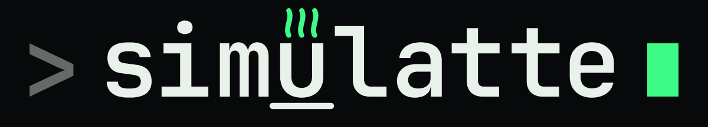

<figure>
  
  <figcaption>
    <a href="https://github.com/dmezzogori/simulatte">GitHub</a> ·
    <a href="https://pypi.org/project/simulatte/">PyPI</a>
  </figcaption>
</figure>

# Simulatte

Discrete-event simulation framework for production planning and control and intralogistics, built on [SimPy](https://simpy.readthedocs.io/).

Simulatte models the dynamics of manufacturing systems: jobs flowing through workstations, release and dispatching policies controlling shopfloor congestion, and supporting infrastructure such as warehouses and AGVs (Automated Guided Vehicles). Use it to design and benchmark scheduling policies, evaluate WIP (Work-in-Progress) control strategies, and run repeatable multi-seed experiments.

- New here? Start with [Getting Started](introduction/basic-usage.md).
- Want job-shop tutorials? Go to [Tutorials](tutorials/index.md).
- Looking for warehouse and AGV simulation? See [Intralogistics](guides/intralogistics.md).

## Install

Requires Python 3.12+ (tested on Python 3.12–3.14).

```bash
pip install simulatte
```

or with [uv](https://docs.astral.sh/uv/):

```bash
uv add simulatte
```

## 5-minute example

```python
from simulatte.environment import Environment
from simulatte.job import ProductionJob
from simulatte.server import Server
from simulatte.shopfloor import ShopFloor

env = Environment()
shopfloor = ShopFloor(env=env)
server = Server(env=env, capacity=1, shopfloor=shopfloor)

job = ProductionJob(
    env=env,
    sku="A",
    servers=[server],
    processing_times=[5.0],
    due_date=100.0,
)

shopfloor.add(job)
env.run()

print(f"Makespan: {job.makespan:.1f}")
print(f"Utilization: {server.utilization_rate:.1%}")
```

## What's next

- [Getting Started](introduction/basic-usage.md): from install to first simulation.
- [Tutorials](tutorials/index.md): copy/paste-friendly walkthroughs covering the core building blocks.
- [Intralogistics](guides/intralogistics.md): warehouse layouts, AGV fleets, and material transport.
- [Agent Skill](development/agent-skill.md): the AI coding agent skill that helps write correct Simulatte simulations.
- [Experimental](guides/reinforcement-learning.md): unstable APIs (Gymnasium RL wrapper).
