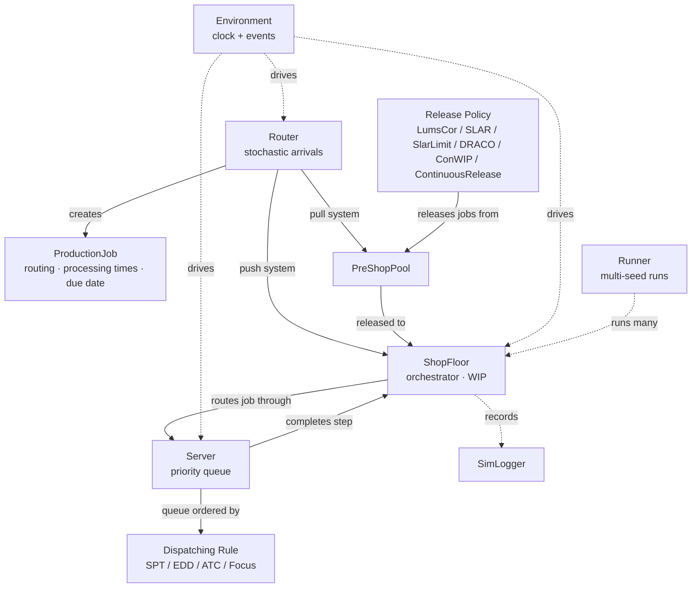
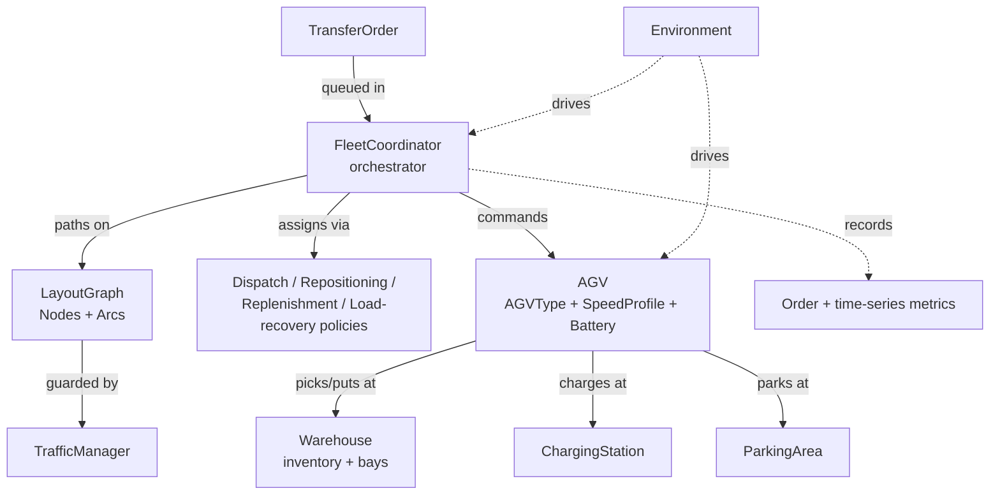

# Core Concepts & Architecture

Simulatte models two complementary domains — production planning (job-shop) and intralogistics (warehouse and AGV) — both built on a shared SimPy `Environment` that drives the simulation clock and event queue. The two domains can run independently or side by side within the same simulation; their orchestrators (`ShopFloor` and `FleetCoordinator`) coordinate all domain-specific behaviour while delegating timing to the common environment.

## Production planning

The `Router` is the stochastic arrival process: it creates `ProductionJob`s — each carrying its server routing, processing times, and absolute due date — and feeds them into the `PreShopPool` (in a pull system) or directly to the `ShopFloor` (in a push system). A release policy (LumsCor, SLAR, SlarLimit, DRACO, ConWIP, or ContinuousRelease) monitors the pool and admits jobs to the `ShopFloor`, the central orchestrator that tracks WIP, fires lifecycle hooks, and maintains EMA performance metrics. The `ShopFloor` then routes each job through its sequence of `Server`s. Each `Server` is a SimPy priority resource that re-orders its queue before every dispatch — calling `sort_queue` to re-evaluate the job's priority policy — and that priority policy is the dispatching rule (SPT, EDD, ATC, Focus, and others). `Runner` repeats the whole simulation across multiple seeds; `SimLogger` records events throughout.

## Intralogistics

A `TransferOrder` is queued in the `FleetCoordinator`, the central orchestrator for all AGV missions. The coordinator assigns an `AGV` via pluggable dispatch and repositioning policies, plans its path across the `LayoutGraph` (a directed graph of nodes and arcs), and enforces node-capacity constraints via a `TrafficManager`. The AGV picks inventory from a source `Warehouse`, transits to the destination, puts it down, and then either recharges at a `ChargingStation` or parks at a `ParkingArea`. All order and time-series metrics are collected throughout.

## How the two domains connect

Both orchestrators — `ShopFloor` for production and `FleetCoordinator` for intralogistics — run as SimPy processes on the same `Environment` clock, so their events interleave naturally without any special coupling. You can combine them in a single simulation by passing the shared `env` instance to both. For the full API surface see the [API Reference](../api/index.md); for worked walkthroughs see the [Production Planning & Control guide](../guides/production-planning.md) and the [Intralogistics guide](../guides/intralogistics.md).
