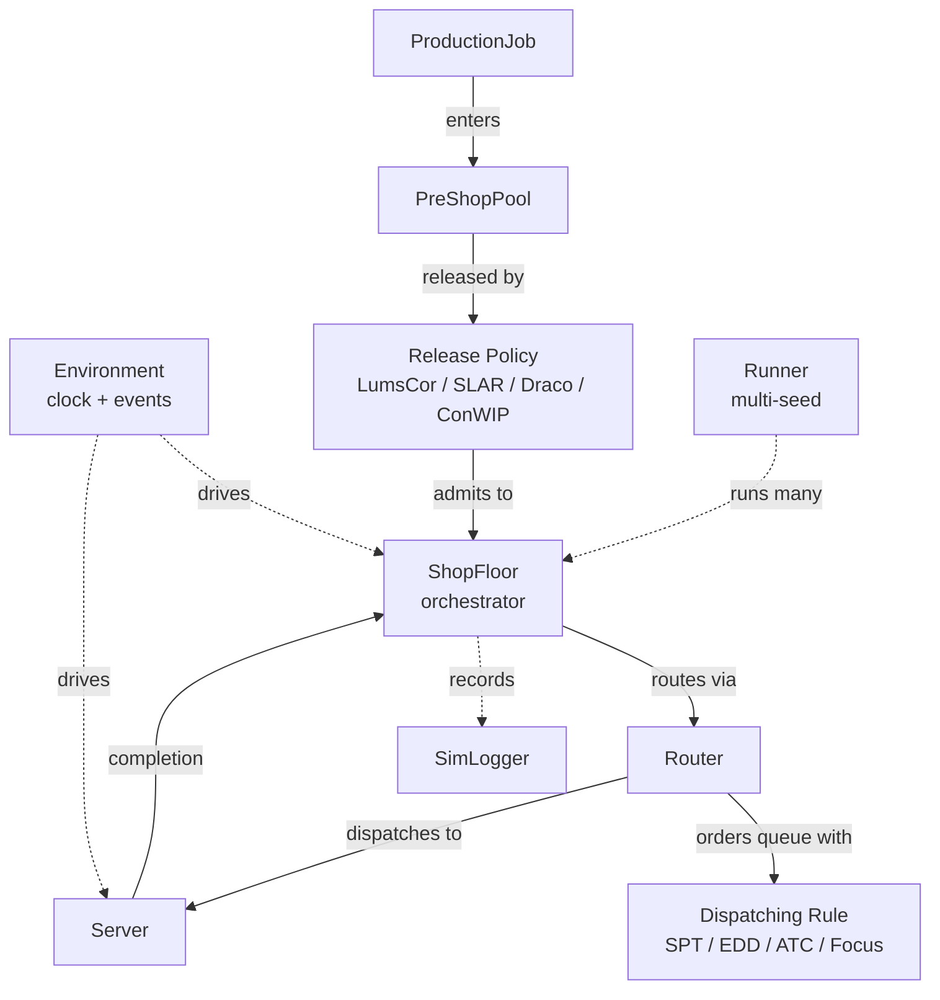
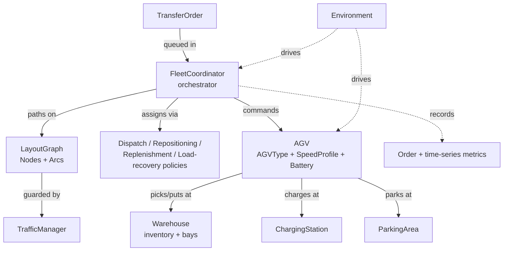

# Web Documentation Information Architecture — Implementation Plan

> **For agentic workers:** REQUIRED SUB-SKILL: Use superpowers:subagent-driven-development (recommended) or superpowers:executing-plans to implement this plan task-by-task. Steps use checkbox (`- [ ]`) syntax for tracking.

**Goal:** Restructure the simulatte.dev documentation into a layer-first (Diátaxis) information architecture and author the new content for items 1 (architecture diagram), 3 (richer tutorials + Examples gallery), and 4 (full API reference) of issue #14.

**Architecture:** Six top-level sections rendered as navigation **tabs** (Introduction · Guides · Tutorials · Examples · API Reference · Development), one directory per section with `index.md` overview pages. Existing pages are relocated with `git mv`; old URLs keep working via zensical redirect stubs; new pages are created then filled with authored content. Work is sequenced in phases that each keep `zensical build` green.

**Tech Stack:** Zensical (MkDocs-based static site generator), mkdocstrings (Python autodoc), mermaid (diagrams), `uv` for tooling.

**Source spec:** `docs/superpowers/specs/2026-05-31-web-docs-information-architecture-design.md`

---

## Conventions used throughout this plan

**Branch.** All work happens on `feature/web-docs-ia` (Phase 0). No commits to `main`.

**Build command.** `uv run zensical build` (baseline is green; build takes ~0.1s). Use `uv run zensical build -c` to clean the cache when a change does not seem to take effect. `zensical --strict` is **unsupported**, so link checking is done with the script added in Task 1.5, not a strict flag.

**Verification spine.** Every task ends in one of:
- *Pages with runnable code* → run the code, confirm output matches what the page claims.
- *Autodoc API pages* → build green **and** the rendered HTML contains the documented symbol (no mkdocstrings "could not collect" warning in build output).
- *Nav/structure* → build green **and** `uv run python scripts/check_docs_links.py` passes.
- *Redirects* → built HTML at the old path contains `window.location.replace("/new/path/...")`.

**Redirect front-matter (verified working).** To redirect an old path, create a markdown file at that old path containing only:
```markdown
---
template: redirect.html
location: /new/absolute/path/
---
```
`location` MUST be root-absolute (leading `/`), or a nested page redirects to the wrong URL.

**mkdocstrings directive (mirror existing `reference.md`).** Members hidden:
```markdown
::: simulatte.<module>.<Symbol>
    options:
      show_root_heading: true
      heading_level: 3
      members: false
```
For the core classes we DO want methods, so those use `members: true` (called out per task).

---

## Target file structure (locked in Phase 1)

```
docs/
  index.md                                 # Introduction → Overview (home, stays at root)
  introduction/
    installation.md                        # NEW (consolidated install)
    basic-usage.md                         # ← getting-started.md
    architecture.md                        # NEW — item 1
  guides/
    index.md                               # NEW — Guides overview
    production-planning.md                 # NEW — concept page
    intralogistics.md                      # ← intralogistics/index.md
    reinforcement-learning.md              # ← experimental/index.md
    troubleshooting.md                     # ← tutorials/troubleshooting.md
  tutorials/
    index.md                               # ← tutorials/index.md (reworded)
    basic-manufacturing-system.md          # keep (same path)
    release-control-and-dispatching.md     # keep
    shopfloor-extensibility.md             # keep
    multi-run-experiments.md               # keep
    logging.md                             # keep
    gymnasium-wrapper.md                   # ← experimental/gymnasium-wrapper.md
    comparing-release-policies.md          # NEW — item 3 (production end-to-end)
    building-an-agv-system.md              # NEW — item 3 (intralogistics)
  examples/
    index.md                               # NEW — Examples gallery overview
    draco.md                               # NEW — wraps examples/draco_simple.py
    focus.md                               # NEW — wraps examples/focus_simple.py
    intralogistics.md                      # ← intralogistics/examples.md
  api/
    index.md                               # NEW — API Reference overview
    core.md                                # NEW — item 4
    release-policies.md                    # ← reference.md (policies block, expanded)
    dispatching-rules.md                   # ← reference.md (dispatching block)
    intralogistics.md                      # NEW — item 4
    utilities.md                           # NEW — item 4
    experimental.md                        # NEW — item 4
  development/
    contributing.md                        # NEW — surfaces CONTRIBUTING.md
    agent-skill.md                         # ← ai-skill.md
    changelog.md                           # NEW (optional, see Task 5.6)
  assets/
    logo.png                               # unchanged (logo = item 2, OUT OF SCOPE)
scripts/
  check_docs_links.py                      # NEW — internal link checker (Task 1.5)
```

**Old → new URL map (drives the redirect stubs in Task 1.4):**

| Old path | New URL |
|---|---|
| `getting-started.md` | `/introduction/basic-usage/` |
| `reference.md` | `/api/` |
| `ai-skill.md` | `/development/agent-skill/` |
| `tutorials/troubleshooting.md` | `/guides/troubleshooting/` |
| `intralogistics/index.md` | `/guides/intralogistics/` |
| `intralogistics/examples.md` | `/examples/intralogistics/` |
| `experimental/index.md` | `/guides/reinforcement-learning/` |
| `experimental/gymnasium-wrapper.md` | `/tutorials/gymnasium-wrapper/` |

`index.md` and the five kept `tutorials/*` pages do not move, so they need no redirect.

---

# Phase 0 — Branch

### Task 0.1: Create the feature branch

**Files:** none.

- [ ] **Step 1: Confirm a clean tree on `main`**

Run: `git status --short && git branch --show-current`
Expected: no uncommitted changes; branch is `main`.

- [ ] **Step 2: Create and switch to the feature branch**

```bash
git switch -c feature/web-docs-ia
```

- [ ] **Step 3: Verify**

Run: `git branch --show-current`
Expected: `feature/web-docs-ia`

---

# Phase 1 — Skeleton (structural move, builds green)

Goal: the full six-section tabbed tree exists, every existing page is relocated, old URLs redirect, every NEW page exists as a minimal stub, internal links resolve, and `zensical build` is green. No authored content yet beyond stubs.

### Task 1.1: Relocate existing pages with `git mv`

**Files:** moves only (content edited in Task 1.3).

- [ ] **Step 1: Create section directories**

```bash
mkdir -p docs/introduction docs/guides docs/examples docs/api docs/development scripts
```

- [ ] **Step 2: Move existing pages to their new paths**

```bash
git mv docs/getting-started.md docs/introduction/basic-usage.md
git mv docs/intralogistics/index.md docs/guides/intralogistics.md
git mv docs/intralogistics/examples.md docs/examples/intralogistics.md
git mv docs/experimental/index.md docs/guides/reinforcement-learning.md
git mv docs/experimental/gymnasium-wrapper.md docs/tutorials/gymnasium-wrapper.md
git mv docs/tutorials/troubleshooting.md docs/guides/troubleshooting.md
git mv docs/ai-skill.md docs/development/agent-skill.md
git mv docs/reference.md docs/api/release-policies.md   # split happens in Task 4.x
```

Note: `docs/examples/` is created by the first `git mv` into it. If git refuses (target dir missing), run `mkdir -p docs/examples` first.

- [ ] **Step 3: Remove now-empty legacy dirs**

```bash
rmdir docs/intralogistics docs/experimental 2>/dev/null || true
```

- [ ] **Step 4: Verify the moves**

Run: `git status --short`
Expected: renames (`R`) for the eight files above; no deletions of content.

### Task 1.2: Write the new tabbed navigation in `zensical.toml`

**Files:**
- Modify: `zensical.toml:9-31` (the `nav` array) and `zensical.toml:63-70` (`theme.features`)

- [ ] **Step 1: Replace the `nav` array**

Replace the existing `nav = [ ... ]` block with:

```toml
nav = [
  { "Introduction" = [
    { "Overview" = "index.md" },
    { "Installation" = "introduction/installation.md" },
    { "Basic Usage" = "introduction/basic-usage.md" },
    { "Core Concepts & Architecture" = "introduction/architecture.md" },
  ]},
  { "Guides" = [
    { "Overview" = "guides/index.md" },
    { "Production Planning & Control" = "guides/production-planning.md" },
    { "Intralogistics" = "guides/intralogistics.md" },
    { "Reinforcement Learning" = "guides/reinforcement-learning.md" },
    { "Troubleshooting" = "guides/troubleshooting.md" },
  ]},
  { "Tutorials" = [
    { "Overview" = "tutorials/index.md" },
    { "Basic manufacturing system" = "tutorials/basic-manufacturing-system.md" },
    { "Release control and dispatching" = "tutorials/release-control-and-dispatching.md" },
    { "ShopFloor extensibility" = "tutorials/shopfloor-extensibility.md" },
    { "Multi-run experiments" = "tutorials/multi-run-experiments.md" },
    { "Logging" = "tutorials/logging.md" },
    { "Gymnasium wrapper (RL)" = "tutorials/gymnasium-wrapper.md" },
    { "Comparing release policies" = "tutorials/comparing-release-policies.md" },
    { "Building an AGV system" = "tutorials/building-an-agv-system.md" },
  ]},
  { "Examples" = [
    { "Overview" = "examples/index.md" },
    { "Draco release (production)" = "examples/draco.md" },
    { "Focus dispatching (production)" = "examples/focus.md" },
    { "Intralogistics" = "examples/intralogistics.md" },
  ]},
  { "API Reference" = [
    { "Overview" = "api/index.md" },
    { "Core" = "api/core.md" },
    { "Release Policies" = "api/release-policies.md" },
    { "Dispatching Rules" = "api/dispatching-rules.md" },
    { "Intralogistics" = "api/intralogistics.md" },
    { "Utilities" = "api/utilities.md" },
    { "Experimental" = "api/experimental.md" },
  ]},
  { "Development" = [
    { "Contributing" = "development/contributing.md" },
    { "Agent Skill" = "development/agent-skill.md" },
    { "Changelog" = "development/changelog.md" },
  ]},
]
```

- [ ] **Step 2: Enable tabs in `theme.features`**

In the `features = [ ... ]` array, add `"navigation.tabs"` and `"navigation.indexes"`. Keep the existing entries. Result:

```toml
features = [
  "content.action.edit",
  "content.action.view",
  "navigation.tabs",
  "navigation.indexes",
  "navigation.instant",
  "navigation.sections",
  "navigation.tracking",
  "toc.follow",
]
```

- [ ] **Step 3: Build (expect failures — stub pages not created yet)**

Run: `uv run zensical build 2>&1 | tail -20`
Expected: build may warn about missing nav targets (`introduction/installation.md`, `api/core.md`, etc.). That is fine — Task 1.3 creates them. Note the warnings; they should match exactly the NEW files listed in the target structure.

### Task 1.3: Create stub pages for every NEW nav entry

**Files (Create):** `docs/introduction/installation.md`, `docs/introduction/architecture.md`, `docs/guides/index.md`, `docs/guides/production-planning.md`, `docs/tutorials/comparing-release-policies.md`, `docs/tutorials/building-an-agv-system.md`, `docs/examples/index.md`, `docs/examples/draco.md`, `docs/examples/focus.md`, `docs/api/index.md`, `docs/api/core.md`, `docs/api/dispatching-rules.md`, `docs/api/intralogistics.md`, `docs/api/utilities.md`, `docs/api/experimental.md`, `docs/development/contributing.md`, `docs/development/changelog.md`

- [ ] **Step 1: Create each stub with a heading and a one-line placeholder body**

Each stub is a real, build-valid page (NOT empty). Use this template, substituting the title:

```markdown
# <Page Title>

!!! note "Work in progress"
    This page is being written. See the [documentation issue](https://github.com/dmezzogori/simulatte/issues/14).
```

Titles to use:
- `installation.md` → `Installation`
- `architecture.md` → `Core Concepts & Architecture`
- `guides/index.md` → `Guides`
- `production-planning.md` → `Production Planning & Control`
- `comparing-release-policies.md` → `Comparing Release Policies`
- `building-an-agv-system.md` → `Building an AGV System`
- `examples/index.md` → `Examples`
- `examples/draco.md` → `Draco Release (Production)`
- `examples/focus.md` → `Focus Dispatching (Production)`
- `api/index.md` → `API Reference`
- `api/core.md` → `Core API`
- `api/dispatching-rules.md` → `Dispatching Rules`
- `api/intralogistics.md` → `Intralogistics API`
- `api/utilities.md` → `Utilities API`
- `api/experimental.md` → `Experimental API`
- `development/contributing.md` → `Contributing`
- `development/changelog.md` → `Changelog`

- [ ] **Step 2: Split the dispatching-rules block out of the relocated `api/release-policies.md`**

`docs/api/release-policies.md` currently holds the full old `reference.md` (policies **and** dispatching). Move the `## Dispatching Rules` section (everything from that heading to end of file) into `docs/api/dispatching-rules.md`, replacing that stub's body. Keep the `# API Reference` H1 only in `api/index.md`; give `release-policies.md` an H1 `# Release Policies` and `dispatching-rules.md` an H1 `# Dispatching Rules`.

- [ ] **Step 3: Build green**

Run: `uv run zensical build -c 2>&1 | tail -20`
Expected: `Build finished` with no missing-nav-target warnings.

### Task 1.4: Add redirect stubs for moved URLs

**Files (Create):** `docs/getting-started.md`, `docs/reference.md`, `docs/ai-skill.md`, `docs/tutorials/troubleshooting.md`, `docs/intralogistics/index.md`, `docs/intralogistics/examples.md`, `docs/experimental/index.md`, `docs/experimental/gymnasium-wrapper.md`

- [ ] **Step 1: Recreate each old path as a redirect stub**

For each row in the Old → new URL map, create a file at the OLD path containing only the redirect front-matter. Example (`docs/getting-started.md`):

```markdown
---
template: redirect.html
location: /introduction/basic-usage/
---
```

Full set:
- `docs/getting-started.md` → `location: /introduction/basic-usage/`
- `docs/reference.md` → `location: /api/`
- `docs/ai-skill.md` → `location: /development/agent-skill/`
- `docs/tutorials/troubleshooting.md` → `location: /guides/troubleshooting/`
- `docs/intralogistics/index.md` → `location: /guides/intralogistics/`
- `docs/intralogistics/examples.md` → `location: /examples/intralogistics/`
- `docs/experimental/index.md` → `location: /guides/reinforcement-learning/`
- `docs/experimental/gymnasium-wrapper.md` → `location: /tutorials/gymnasium-wrapper/`

These files are NOT added to `nav` (redirect-only orphan pages).

- [ ] **Step 2: Build and confirm a redirect renders**

Run:
```bash
uv run zensical build
sed -n '1,15p' site/getting-started/index.html
```
Expected: HTML contains `window.location.replace(["/introduction/basic-usage/",...` and a `<meta http-equiv="refresh" content="0;url=/introduction/basic-usage/">`.

### Task 1.5: Add the internal link checker and fix cross-links

**Files:**
- Create: `scripts/check_docs_links.py`
- Modify: any page whose internal links broke from the moves (see Step 3)

- [ ] **Step 1: Create the link checker**

```python
# scripts/check_docs_links.py
"""Fail if any internal link in the built site/ does not resolve to a file.

zensical has no --strict mode, so this is our link gate. Run AFTER `zensical build`.
Covers page-to-page links; skips external URLs, anchors, mailto, and assets.
"""
from __future__ import annotations

import re
import sys
from pathlib import Path

SITE = Path("site")
HREF = re.compile(r'href="([^"]+)"')
SKIP_PREFIXES = ("http://", "https://", "mailto:", "//", "data:", "#", "javascript:")


def resolve(base: Path, target: str) -> bool:
    target = target.split("#", 1)[0].split("?", 1)[0]
    if not target:
        return True
    if target.startswith("/"):
        p = SITE / target.lstrip("/")
    else:
        p = base / target
    candidates = [p, p / "index.html"]
    if p.suffix == "":
        candidates.append(Path(f"{p}.html"))
    return any(c.exists() for c in candidates)


def main() -> int:
    if not SITE.exists():
        print("site/ not found — run `uv run zensical build` first", file=sys.stderr)
        return 2
    missing: list[tuple[str, str]] = []
    for html in SITE.rglob("*.html"):
        for m in HREF.finditer(html.read_text(encoding="utf-8")):
            target = m.group(1)
            if target.startswith(SKIP_PREFIXES):
                continue
            if "/assets/" in target:
                continue
            if not resolve(html.parent, target):
                missing.append((str(html.relative_to(SITE)), target))
    if missing:
        print(f"BROKEN INTERNAL LINKS: {len(missing)}")
        for src, tgt in sorted(set(missing))[:200]:
            print(f"  {src} -> {tgt}")
        return 1
    print(f"OK — all internal links resolve ({sum(1 for _ in SITE.rglob('*.html'))} pages scanned).")
    return 0


if __name__ == "__main__":
    raise SystemExit(main())
```

- [ ] **Step 2: Run it to find broken cross-links**

Run: `uv run zensical build && uv run python scripts/check_docs_links.py`
Expected: a list of broken links originating from moved/kept pages (e.g. `index.md` links to `getting-started.md`, `tutorials/index.md`, `intralogistics/index.md`; `tutorials/index.md` links to `../ai-skill.md`; etc.).

- [ ] **Step 3: Fix the cross-links in source markdown**

Update the markdown links to the new paths. Known references to fix (search each file):
- `docs/index.md`: `getting-started.md` → `introduction/basic-usage.md`; `tutorials/index.md` (unchanged); `intralogistics/index.md` → `guides/intralogistics.md`; `ai-skill.md` → `development/agent-skill.md`; `experimental/index.md` → `guides/reinforcement-learning.md`.
- `docs/introduction/basic-usage.md`: `tutorials/index.md` (unchanged); `intralogistics/index.md` → `../guides/intralogistics.md`; `ai-skill.md` → `../development/agent-skill.md`.
- `docs/tutorials/index.md`: `../ai-skill.md` → `../development/agent-skill.md`.
- `docs/guides/intralogistics.md`: `examples.md` → `../examples/intralogistics.md`; `../getting-started.md` → `../introduction/basic-usage.md`; `../tutorials/index.md` (unchanged).
- `docs/guides/reinforcement-learning.md`: `gymnasium-wrapper.md` → `../tutorials/gymnasium-wrapper.md`; `../intralogistics/index.md` → `intralogistics.md`.
- `docs/examples/intralogistics.md`: any `../tutorials/...` or `index.md` links → recompute relative to `examples/`.
- `docs/tutorials/gymnasium-wrapper.md`: any links back to `index.md`/experimental → recompute.

Run `grep -rnE '\]\((\.\.?/)?(getting-started|reference|ai-skill|intralogistics/|experimental/|tutorials/troubleshooting)' docs/` to catch stragglers.

- [ ] **Step 4: Verify green build + links**

Run: `uv run zensical build && uv run python scripts/check_docs_links.py`
Expected: `OK — all internal links resolve`.

### Task 1.6: Visually verify tabs render, then commit Phase 1

- [ ] **Step 1: Serve and eyeball the tabs**

Run: `uv run zensical serve` (then open the local URL). Confirm six top tabs appear (Introduction, Guides, Tutorials, Examples, API Reference, Development) and clicking each shows its sidebar pages. Stop the server.

- [ ] **Step 2: Commit**

```bash
git add -A
git commit -m "docs: restructure site into layer-first tabbed IA (skeleton)

Relocate existing pages, add redirect stubs for moved URLs, enable
navigation.tabs, create stubs for new sections, add internal link
checker. Builds green. Refs #14."
```

---

# Phase 2 — API Reference (item 4)

Goal: every API group documented with a short narrative intro + mkdocstrings autodoc. The autodoc directives below are exact; the narrative intros are specified as outlines (author the prose at execution).

### Task 2.1: API Reference overview (`api/index.md`)

**Files:** Modify `docs/api/index.md`

- [ ] **Step 1: Replace the stub with the overview**

Content outline (author prose to fit):
- H1 `# API Reference`.
- One paragraph: this section is auto-generated from docstrings; narrative guides live under Tutorials and Guides (link to `../tutorials/index.md` and `../guides/index.md`).
- A bullet list linking each group page: Core, Release Policies, Dispatching Rules, Intralogistics, Utilities, Experimental — each with a one-line description of what it covers.

- [ ] **Step 2: Verify**

Run: `uv run zensical build && uv run python scripts/check_docs_links.py`
Expected: green + links resolve.

### Task 2.2: Core API (`api/core.md`)

**Files:** Modify `docs/api/core.md`

**Exact symbols** (root `__init__` is empty → use full module paths). The PSP class is `PreShopPool`. `TransportJob`/`WarehouseJob` do **not** exist — do not reference them.

- [ ] **Step 1: Write the page**

Narrative intro outline: one paragraph naming the core objects and how they relate (Environment drives the clock; ShopFloor orchestrates; ProductionJob routes through Servers via Router; PreShopPool holds jobs before release; Runner repeats simulations). Link to `../introduction/architecture.md` for the diagram.

Then these directives (members shown for the main classes):

```markdown
## Environment

::: simulatte.environment.Environment
    options:
      heading_level: 3
      members: true

## ShopFloor

::: simulatte.shopfloor.ShopFloor
    options:
      heading_level: 3
      members: true

## Server

::: simulatte.server.Server
    options:
      heading_level: 3
      members: true

## ProductionJob

::: simulatte.job.ProductionJob
    options:
      heading_level: 3
      members: true

## Router

::: simulatte.router.Router
    options:
      heading_level: 3
      members: true

## PreShopPool

::: simulatte.psp.PreShopPool
    options:
      heading_level: 3
      members: true

## Runner

::: simulatte.runner.Runner
    options:
      heading_level: 3
      members: true

## Extension points

::: simulatte.shopfloor.OperationHook
    options:
      heading_level: 3
      members: false

::: simulatte.shopfloor.WIPStrategy
    options:
      heading_level: 3
      members: false

::: simulatte.shopfloor.StandardWIPStrategy
    options:
      heading_level: 3
      members: false

::: simulatte.shopfloor.CorrectedWIPStrategy
    options:
      heading_level: 3
      members: false

::: simulatte.shopfloor.MetricsCollector
    options:
      heading_level: 3
      members: false

::: simulatte.shopfloor.Dispatcher
    options:
      heading_level: 3
      members: false
```

- [ ] **Step 2: Verify symbols render**

Run: `uv run zensical build 2>&1 | grep -i "could not collect\|error" || echo "no collection errors"`
Then: `grep -l "PreShopPool" site/api/core/index.html`
Expected: no collection errors; `PreShopPool` (and the other class names) present in the built HTML.

### Task 2.3: Intralogistics API (`api/intralogistics.md`)

**Files:** Modify `docs/api/intralogistics.md`

**Exact symbols** (all importable from `simulatte.intralogistics`): grouped below. Use `members: false` to keep the page navigable (it has many classes).

- [ ] **Step 1: Write the page**

Narrative intro outline: one paragraph — everything imports from the single `simulatte.intralogistics` namespace; pointer to the Intralogistics guide (`../guides/intralogistics.md`) for concepts and the gallery (`../examples/intralogistics.md`).

Then `## <Group>` headings each followed by `::: simulatte.intralogistics.<Symbol>` directives (`heading_level: 3`, `members: false`) for:
- **Layout:** `Node`, `Arc`, `LayoutGraph`
- **Pathfinding:** `PathPlanner`, `DijkstraPlanner`, `AStarPlanner`
- **Traffic:** `TrafficManager`, `FreeTrafficManager`, `ResourceBasedTrafficManager`, `PathCheckResult`
- **Products & storage:** `SKU`, `Warehouse`
- **Vehicles:** `AGV`, `AGVType`, `AGVState`, `SpeedProfile`, `TrapezoidalProfile`, `Battery`
- **Facilities:** `ChargingStation`, `ParkingArea`
- **Orders:** `TransferOrder`, `OrderStatus`
- **Orchestration:** `FleetCoordinator`
- **Policies:** `DispatchStrategy`, `NearestIdleStrategy`, `RoundRobinStrategy`, `ReplenishmentPolicy`, `ReorderPointPolicy`, `RepositioningPolicy`, `RepositioningContext`, `StayInPlace`, `NearestParkingPolicy`, `LoadRecoveryStrategy`, `ReturnToOrigin`, `ResumeDelivery`
- **Metrics:** `OrderMetricsCollector`, `EMAOrderMetrics`, `IntralogisticsTimeSeriesCollector`, `DefaultIntralogisticsCollector`
- **Builders:** `build_simple_system`

- [ ] **Step 2: Verify**

Run: `uv run zensical build 2>&1 | grep -i "could not collect" || echo "no collection errors"`
Then: `grep -l "FleetCoordinator" site/api/intralogistics/index.html`
Expected: no collection errors; `FleetCoordinator` present.

### Task 2.4: Utilities API (`api/utilities.md`)

**Files:** Modify `docs/api/utilities.md`

- [ ] **Step 1: Write the page**

Narrative intro outline: one sentence — builder functions, distributions, and logging helpers.

Directives (`heading_level: 3`, `members: false` except `RunningStats`/logger classes may use `members: true`):
- **Builders:** `simulatte.builders.build_immediate_release_system`, `build_focus_system`, `build_lumscor_system`, `build_slar_system`, `build_slar_limit_system`, `build_draco_system`
- **Distributions:** `simulatte.distributions.server_sampling`, `truncated_2erlang`, `RunningStats`
- **Logging:** `simulatte.logger.SimLogger`, `LogEvent`, `EventHistoryBuffer`, `SQLiteEventStore`

- [ ] **Step 2: Verify**

Run: `uv run zensical build 2>&1 | grep -i "could not collect" || echo "no collection errors"`
Then: `grep -l "build_lumscor_system" site/api/utilities/index.html`
Expected: no collection errors; symbol present.

### Task 2.5: Experimental API (`api/experimental.md`)

**Files:** Modify `docs/api/experimental.md`

- [ ] **Step 1: Write the page**

Narrative intro outline: one paragraph — unstable API; `SimulatteEnv` is a Gymnasium `Env` ABC; subclasses implement six abstract methods; link to the RL guide (`../guides/reinforcement-learning.md`) and the wrapper tutorial (`../tutorials/gymnasium-wrapper.md`).

```markdown
## SimulatteEnv

::: simulatte.experimental.SimulatteEnv
    options:
      heading_level: 3
      members: true
```

- [ ] **Step 2: Verify**

Run: `uv run zensical build 2>&1 | grep -i "could not collect" || echo "no collection errors"`
Then: `grep -l "SimulatteEnv" site/api/experimental/index.html`
Expected: present, no errors.

### Task 2.6: Expand Release Policies (`api/release-policies.md`)

**Files:** Modify `docs/api/release-policies.md`

The relocated file already documents `Slar`, `SlarLimit`, `LumsCor`, `Draco`. Add the missing policies and triggers.

- [ ] **Step 1: Append the missing directives**

Add `## ConWIP`, `## ContinuousRelease`, a `## Triggers` section (`on_arrival_trigger`, `on_completion_trigger`, `periodic_trigger`), and `## Starvation avoidance` (`starvation_avoidance`), each with `::: simulatte.policies.<Symbol>` (`heading_level: 3`/`4` to match the file's existing levels, `members: false`).

- [ ] **Step 2: Verify**

Run: `uv run zensical build 2>&1 | grep -i "could not collect" || echo "no collection errors"`
Then: `grep -l "ConWIP" site/api/release-policies/index.html`
Expected: present, no errors.

### Task 2.7: Commit Phase 2

- [ ] **Step 1: Verify the whole site**

Run: `uv run zensical build -c && uv run python scripts/check_docs_links.py`
Expected: green + links resolve.

- [ ] **Step 2: Commit**

```bash
git add -A
git commit -m "docs(api): document Core, Intralogistics, Utilities, Experimental; expand policies

Six API Reference groups now covered by narrative intros + mkdocstrings
autodoc. Refs #14."
```

---

# Phase 3 — Core Concepts & Architecture (item 1) + Guides

### Task 3.1: Architecture page with component diagram (`introduction/architecture.md`)

**Files:** Modify `docs/introduction/architecture.md`

Mermaid is wired up (custom fence) and already used elsewhere, so a ```mermaid fenced block renders.

- [ ] **Step 1: Write the page**

Structure (author prose for each section; the diagrams below are the deterministic content):

1. H1 `# Core Concepts & Architecture` + one-paragraph orientation (two domains: production planning and intralogistics, both on SimPy).
2. `## Production planning` — 2–4 sentences naming each component, then this diagram:

````markdown

````

3. `## Intralogistics` — 2–4 sentences, then this diagram:

````markdown

````

4. `## How the two connect` — short paragraph: both orchestrators (ShopFloor, FleetCoordinator) share the same `Environment`; pointer to the API Reference (`../api/index.md`).

- [ ] **Step 2: Verify the diagrams render**

Run: `uv run zensical build && grep -c "mermaid" site/introduction/architecture/index.html`
Expected: ≥ 2 (two mermaid blocks present). Serve and eyeball that both diagrams draw without syntax errors.

### Task 3.2: Production Planning & Control guide (`guides/production-planning.md`)

**Files:** Modify `docs/guides/production-planning.md`

- [ ] **Step 1: Write the page**

Mirror the depth/structure of the existing Intralogistics guide (`guides/intralogistics.md`). Sections (author prose):
- H1 + one-paragraph framing.
- `## Core concepts` — short subsections for: Jobs & routing (`ProductionJob`, processing times, due dates), Servers & queues, Pre-shop pool & release control (link to release-policies API), Dispatching (link to dispatching-rules API), WIP & metrics.
- `## Where to go next` — links to the Tutorials (`../tutorials/index.md`), the Examples (`../examples/index.md`), and the Core API (`../api/core.md`).

- [ ] **Step 2: Fill the Guides overview (`guides/index.md`)**

Replace its stub: H1 `# Guides` + one paragraph + bullets linking the four guide pages (Production Planning & Control, Intralogistics, Reinforcement Learning, Troubleshooting) with one-line descriptions.

- [ ] **Step 3: Verify**

Run: `uv run zensical build && uv run python scripts/check_docs_links.py`
Expected: green + links resolve.

### Task 3.3: Installation page + Troubleshooting tidy

**Files:** Modify `docs/introduction/installation.md`, `docs/guides/troubleshooting.md`, `docs/index.md`, `docs/introduction/basic-usage.md`

- [ ] **Step 1: Author the Installation page**

Consolidate the install instructions currently duplicated in `index.md` and `basic-usage.md`: H1 `# Installation`, Python 3.12+ note, `pip install simulatte`, `uv add simulatte`. Then trim the duplicated install blocks in `index.md` and `basic-usage.md` to a one-line pointer to `introduction/installation.md` (keep the 5-minute example in `index.md`).

- [ ] **Step 2: Lightly expand Troubleshooting**

The relocated `guides/troubleshooting.md` is a stub. Keep its existing gotchas; add an intro sentence framing it as a how-to. (Deep expansion is out of scope; do not invent issues — only document real, known gotchas already referenced in the agent skill / tutorials.)

- [ ] **Step 3: Verify + commit Phase 3**

Run: `uv run zensical build -c && uv run python scripts/check_docs_links.py`
Expected: green + links resolve.

```bash
git add -A
git commit -m "docs: add architecture diagram, production-planning guide, installation page

Item 1 (component diagrams) + Guides explanation layer. Refs #14."
```

---

# Phase 4 — Tutorials & Examples gallery (item 3)

For every page with code in this phase, the verifying step RUNS the code. Save runnable scripts under `examples/` where the page lifts from an existing script; new tutorial snippets must be runnable as shown.

### Task 4.1: Examples gallery overview (`examples/index.md`)

**Files:** Modify `docs/examples/index.md`

- [ ] **Step 1: Write the gallery overview**

H1 `# Examples` + one paragraph (runnable scenarios, graded simple→advanced) + a table/list with one row per example: name, domain (production/intralogistics), what it demonstrates, link. Rows: Draco release, Focus dispatching, Intralogistics (simple/intermediate/advanced). Link to the `examples/` source folder on GitHub.

- [ ] **Step 2: Verify**

Run: `uv run zensical build && uv run python scripts/check_docs_links.py`
Expected: green + links resolve.

### Task 4.2: Production example pages (`examples/draco.md`, `examples/focus.md`)

**Files:** Modify `docs/examples/draco.md`, `docs/examples/focus.md`

- [ ] **Step 1: Run the source scripts and capture output**

```bash
uv run python examples/draco_simple.py
uv run python examples/focus_simple.py
```
Expected: both run without error; note the printed output.

- [ ] **Step 2: Write each gallery page**

Per page, structure: H1; one-paragraph "what this shows"; the runnable code (lift verbatim from `examples/draco_simple.py` / `examples/focus_simple.py` inside a ```python block); an "Output" subsection with the captured console output inside a text block; 2–3 sentences interpreting the result. Link to the relevant API/guide pages.

- [ ] **Step 3: Verify the code in the page actually runs**

Re-run the source script (the page content must match it):
Run: `uv run python examples/draco_simple.py && uv run python examples/focus_simple.py`
Expected: matches the Output shown on the pages.
Then: `uv run zensical build && uv run python scripts/check_docs_links.py` → green.

### Task 4.3: Intralogistics gallery page (`examples/intralogistics.md`)

**Files:** Modify `docs/examples/intralogistics.md` (relocated from `intralogistics/examples.md`)

- [ ] **Step 1: Reframe as a gallery entry**

The relocated page already has layout diagrams + feature progression for the three intralogistics scripts. Ensure its internal links point at the new structure (done in Task 1.5) and that it reads as the "Intralogistics" gallery entry (heading/intro consistent with `examples/index.md`). No content rewrite required beyond link/heading fixes.

- [ ] **Step 2: Run the three scripts**

```bash
uv run python examples/intralogistics_simple.py
uv run python examples/intralogistics_intermediate.py
uv run python examples/intralogistics_advanced.py
```
Expected: all run without error; output matches what the page claims.

- [ ] **Step 3: Verify**

Run: `uv run zensical build && uv run python scripts/check_docs_links.py`
Expected: green + links resolve.

### Task 4.4: New tutorial — Comparing release policies (`tutorials/comparing-release-policies.md`)

**Files:**
- Modify: `docs/tutorials/comparing-release-policies.md`
- Create (optional helper): `examples/comparing_release_policies.py` (the runnable end-to-end script the tutorial mirrors)

**Objective:** a richer, scenario-driven production tutorial (vs the mechanical building-block ones): build a multi-server shop, drive it with an arrival stream, run **Immediate Release vs LumsCor vs SLAR** across seeds with `Runner`, collect a tardiness/WIP metric, and interpret the trade-off.

- [ ] **Step 1: Write a runnable end-to-end script**

Create `examples/comparing_release_policies.py` using the builder functions (`build_immediate_release_system`, `build_lumscor_system`, `build_slar_system`) and `Runner` for multi-seed runs. It must print a small comparison table (policy → mean tardiness / mean WIP). Keep it self-contained and deterministic given a seed.

- [ ] **Step 2: Run it**

Run: `uv run python examples/comparing_release_policies.py`
Expected: prints the comparison table without error.

- [ ] **Step 3: Write the tutorial page**

Sections (author prose around the verified code): motivation (why release control matters); the scenario/shop setup; running the three policies with `Runner`; the results table (paste captured output); interpretation (when each policy wins); next steps (links to release-control tutorial, release-policies API). Embed the code from Step 1 in ```python blocks.

- [ ] **Step 4: Verify**

Run: `uv run python examples/comparing_release_policies.py && uv run zensical build && uv run python scripts/check_docs_links.py`
Expected: script runs, build green, links resolve.

### Task 4.5: New tutorial — Building an AGV system (`tutorials/building-an-agv-system.md`)

**Files:**
- Modify: `docs/tutorials/building-an-agv-system.md`
- Create (optional helper): `examples/building_an_agv_system.py`

**Objective:** a guided intralogistics walkthrough: from a `LayoutGraph` + two `Warehouse`s + an `AGV` fleet + `FleetCoordinator` to dispatched `TransferOrder`s and a metrics read-out. Bridges the conceptual Intralogistics guide and the existing example scripts.

- [ ] **Step 1: Write a runnable script**

Create `examples/building_an_agv_system.py`. Prefer `build_simple_system` for the scaffold, then dispatch a few `TransferOrder`s and print order metrics from `EMAOrderMetrics` / `DefaultIntralogisticsCollector`. Keep it minimal and runnable.

- [ ] **Step 2: Run it**

Run: `uv run python examples/building_an_agv_system.py`
Expected: runs without error; prints metrics.

- [ ] **Step 3: Write the tutorial page**

Sections (author prose around the verified code): build the layout; add warehouses and inventory; configure the AGV fleet; wire the `FleetCoordinator` and policies; dispatch orders; read metrics. Step-by-step with ```python blocks lifted from the verified script. Link to the Intralogistics guide and API, and to the Examples gallery for fuller scenarios.

- [ ] **Step 4: Verify**

Run: `uv run python examples/building_an_agv_system.py && uv run zensical build && uv run python scripts/check_docs_links.py`
Expected: script runs, build green, links resolve.

### Task 4.6: Tutorials & gymnasium-wrapper tidy + Development pages

**Files:** Modify `docs/tutorials/index.md`, `docs/tutorials/gymnasium-wrapper.md`, `docs/development/contributing.md`, `docs/development/changelog.md`

- [ ] **Step 1: Update the Tutorials overview**

`tutorials/index.md`: add list entries for the two new tutorials and the Gymnasium wrapper; ensure all links resolve.

- [ ] **Step 2: gymnasium-wrapper page**

Confirm the relocated `tutorials/gymnasium-wrapper.md` reads as a tutorial (it is a walkthrough); fix any stale links to `experimental/` or `index.md` (recompute relative to `tutorials/`).

- [ ] **Step 3: Contributing page**

`development/contributing.md`: short page summarizing the `CONTRIBUTING.md` workflow (branch `feature/<name>` / `fix/<name>`, open a PR, all checks pass, squash-merge by maintainer) and linking to the repo `CONTRIBUTING.md`. Do not duplicate the whole file.

- [ ] **Step 4: Changelog page (decision point)**

If the repo maintains release notes, link/point to them from `development/changelog.md`. If not, either (a) leave a brief "see GitHub Releases" pointer, or (b) remove the `Changelog` nav entry and delete the file. Pick one; do not leave a bare stub. **Default: keep a one-line pointer to GitHub Releases.**

- [ ] **Step 5: Verify + commit Phase 4**

Run: `uv run zensical build -c && uv run python scripts/check_docs_links.py`
Expected: green + links resolve.

```bash
git add -A
git commit -m "docs: add Examples gallery and two scenario tutorials; finish Development section

Item 3 (richer tutorials + runnable gallery). Refs #14."
```

---

# Phase 5 — Finalize

### Task 5.1: Publish hygiene for planning docs

**Files:** `zensical.toml` or `docs/superpowers/`

- [ ] **Step 1: Keep `docs/superpowers/` out of the published site**

Per the earlier cleanup (`93b3c36`), planning docs must not ship. Choose ONE:
- (a) Add a build-time exclude for `docs/superpowers/` if zensical supports an `exclude`/`not_in_nav` option (check `uv run zensical build --help` and zensical docs); OR
- (b) Document in the PR that `docs/superpowers/` is pruned before merge/release (matching prior practice).

**Default: (b)** — note it in the PR description; do not delete the spec/plan from the branch while implementing.

- [ ] **Step 2: Verify build still green**

Run: `uv run zensical build -c && uv run python scripts/check_docs_links.py`
Expected: green + links resolve.

### Task 5.2: Open the PR

- [ ] **Step 1: Push and open a PR**

```bash
git push -u origin feature/web-docs-ia
gh pr create --fill --title "docs: layer-first IA + architecture diagram, fuller API, richer tutorials (#14)"
```

- [ ] **Step 2: PR body checklist**

Confirm the PR notes: redirects added for all moved URLs; `docs/superpowers/` excluded/pruned; item 2 (logo) intentionally out of scope; `navigation.tabs` enabled.

---

## Self-review checklist (run before handing off)

- [ ] **Spec coverage** — Introduction/Guides/Tutorials/Examples/API/Development all built (Phases 1–4); item 1 = Task 3.1; item 3 = Tasks 4.2–4.5; item 4 = Tasks 2.2–2.6; item 5 = Phase 1; item 2 explicitly out of scope.
- [ ] **Redirects** — every row of the Old → new URL map has a stub (Task 1.4).
- [ ] **No broken links** — `scripts/check_docs_links.py` is the gate (zensical has no `--strict`).
- [ ] **Naming** — `PreShopPool` (not `PSP`); no `TransportJob`/`WarehouseJob`; absolute `location:` in redirects.
- [ ] **Runnable code** — every code-bearing page is verified by running the script (Tasks 4.2–4.5).
